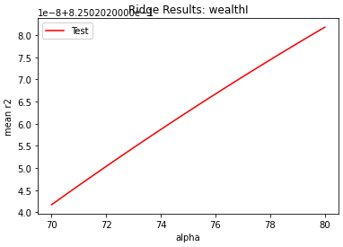
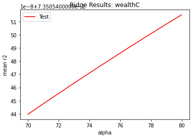
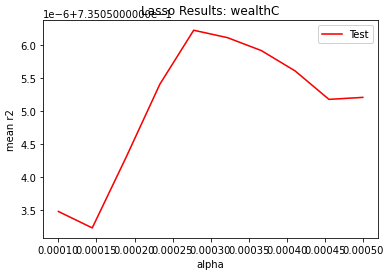
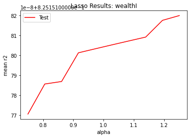
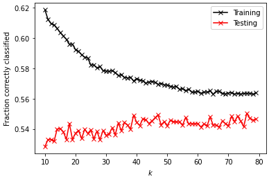
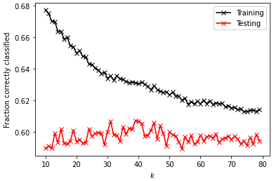
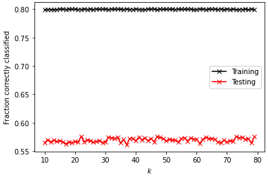

# Project 5 

## Part 1

In order to answer the question of Which of the models produced the best results in predicting wealth of all persons throughout the smaller West African country I processed the given data and then created three models: linear regression, ridge regression, and a lasso regression.

### Preprocessing

Before I began processing the csv file provided, I knew that I would have to drop the wealthC and wealthI columns (given that they are target variables in this assignment). I dropped both target columns, and then tried to perform an operation on the filtered table. It turned out the data was populated with a few NaN values so I had to go back and drop all NaN observations before I could begin creating models. After dropping NaN observations with `df.dropna(inplace=True)` I began creating my models for both wealthC and wealthI.

### Model Creation

**Linear Regression**

For my linear regression, I create four models total. I had two target variables, and within those two target variables I wanted to see what would happen if I standardized the data and recreated the model.

I started off with the wealthC target variable. The model without standardization performed somewhat well with an r squared value of 0.735822. After standardization, the model performed nearly exactly the same with an r squared value of 0.735821. While the r squared values of the wealthC linear regression aren't markedly different, the model coefficients after standardization are smaller (in absolute value).

non-standardized model coeff:
 ```python
 [ 3.01812923e-02  1.07882853e-02 -5.57603897e-04  8.37880684e-02
  4.04701739e-02  6.37198352e-02 -1.40023112e-01  9.99896825e-02
  1.85515805e-01 -2.49517259e-01 -2.47122665e-01 -7.30324831e-02
  3.09612080e-01 -1.29375995e-01  3.53607318e-01  2.33225714e-01
 -1.34364084e-01 -1.92558301e-01 -1.20146711e-01  3.59279100e-02
  1.46004504e-01 -1.81932414e-01  1.05944573e-01  4.00186663e-01
  1.72822325e-01  2.29943453e-02  1.03043774e-01 -1.15888783e-01
 -2.18966624e-01 -2.90949455e-01 -3.83672661e-01 -3.84737293e-01
  3.07519898e-01  2.55401258e-02  2.56163113e-01  3.95033383e-01
  3.60442298e-01  1.90435535e-01  3.86891012e-01  1.53405264e-01
 -2.09042764e-02  5.43122461e-02 -1.27172669e-01 -5.40268677e-01
 -5.63637093e-01 -1.58355761e-01 -1.08923385e-01 -2.12578757e-02
 -3.26132080e-01  3.26132080e-01 -6.44297719e-02  6.44297719e-02
 -2.76390443e-01  4.32693258e-01  6.03439291e-02  4.07576086e-01
 -6.37787977e-01  1.35651470e-02 -2.47897601e-01  2.47897601e-01]
 ```

 standardized model coeff:
 ```python
 [ 1.12548658e-01  5.24358116e-03 -1.08884589e-02  6.92579735e-02
  7.36951509e+10  8.66257201e+10  7.69209583e+10  7.91372426e+10
  8.45473781e+10  7.89854838e+10  7.88333540e+10  8.76583681e+10
  8.66134726e+10  8.54267349e+10  1.16140874e+11  1.01070442e+11
  7.65053798e+10  7.51091695e+10  8.19133567e+10  4.80000747e+10
  7.26531241e+10  7.87003037e+10 -6.56609287e+09 -6.60161265e+09
 -1.20447035e+10 -1.40140921e+10 -7.23238899e+10 -3.56557715e+10
 -1.50138208e+10 -2.23537221e+10 -6.34833466e+10 -4.69533271e+09
 -7.80211026e+09 -1.23673099e+10 -1.59629508e+10  5.30991560e+10
  2.31813714e+11  8.95044996e+10  4.32553262e+10  1.67206073e+10
  3.49539754e+11  2.11161816e+11  2.27988135e+11  4.41825617e+11
  1.81354767e+10  2.62747629e+10  1.66594092e+11  3.43909538e+10
 -2.42890031e+11 -2.42890031e+11  1.82248582e+10  1.82248582e+10
  1.21238081e+10  5.65381739e+09  1.10197079e+10  2.38345511e+11
  2.39952072e+11  3.49669495e+10 -4.32651302e+10 -4.32651302e+10]
  ```

The wealthI target variable had results similar to the wealthC target variable. Without standardization the model had an r squared value of 0.825827, and with standardization had an r squared value of 0.825826. The coefficients showed a different pattern; the standardized values are larger in absolute value compared to the non-standardized values.

non-standardized model coeff:
 ```python
 [ 2.31986195e+03  1.08192000e+03 -5.08892487e+01  6.53283809e+03
  3.17688859e+03  4.03623951e+03 -9.96051610e+03  1.12302854e+04
  1.02336910e+04 -1.62924258e+04 -1.71918653e+04 -6.04206999e+03
  2.08751277e+04 -9.31120042e+03  2.41734580e+04  1.34930387e+04
 -6.80151578e+03 -1.25300357e+04 -9.08909982e+03  5.48192929e+03
  7.99367502e+03 -1.34756043e+04  1.74439055e+04  3.27144540e+04
  5.76665872e+03  3.89473708e+02  2.46689944e+03 -1.29356339e+04
 -1.29054696e+04 -2.77376917e+04 -2.95652191e+04 -2.65078796e+04
  2.29944393e+04 -3.88963009e+03  3.17656932e+04  4.00606955e+04
  3.66535576e+04  9.64026616e+03  4.80974344e+04  9.98177625e+03
 -1.07028288e+04 -9.12002749e+03 -1.86232403e+04 -4.61832386e+04
 -3.14138344e+04 -7.19146447e+03 -1.55796604e+04 -5.61943537e+03
 -3.46563978e+04  3.46563978e+04 -3.20570735e+04  3.20570735e+04
  1.51485651e+03  5.89549456e+04  2.36376276e+04  9.41611219e+03
 -6.81569745e+04 -2.53665673e+04 -2.24372689e+04  2.24372689e+04]
 ```

 standardized model coeff:
 ```python
 [ 8.64993728e+03  5.31704713e+02 -1.00083919e+03  5.39975577e+03
  5.08584139e+15  5.97820436e+15  5.30846044e+15  5.46141040e+15
  5.83477406e+15  5.45093724e+15  5.44043848e+15  6.04946935e+15
  5.97735914e+15  5.89546013e+15  8.01510082e+15  6.97506186e+15
  5.27978059e+15  5.18342548e+15  5.65299528e+15  3.31257571e+15
  5.01392915e+15  5.43125643e+15 -4.53138456e+14 -4.55589743e+14
 -8.31227714e+14 -9.67138936e+14 -4.99120808e+15 -2.46067205e+15
 -1.03613210e+15 -1.54267253e+15 -4.38110551e+15 -3.24033768e+14
 -5.38438348e+14 -8.53491387e+14 -1.10163335e+15  3.66447293e+15
  1.59979017e+16  6.17687436e+15  2.98513166e+15  1.15392065e+15
  2.41223979e+16  1.45726753e+16  1.57338913e+16  3.04912193e+16
  1.25156346e+15  1.81327095e+15  1.14969726e+16  2.37338460e+15
 -1.67622992e+16 -1.67622992e+16  1.25773184e+15  1.25773184e+15
  8.36686869e+14  3.90180604e+14  7.60490828e+14  1.64486734e+16
  1.65595452e+16  2.41313515e+15 -2.98580826e+15 -2.98580826e+15]  
  ```

**Ridge Regression**

My ridge regression included two models; one for each of the target variables. I began by reformatting the data to an array (this fixed some issues I had with r2 results).


My wealthC model, with an optimal alpha value in the range of 70 to 80, had an r squared value of 0.735054. Below is a graph of how I found the optimal alpha value:



My wealthI model, with an optimal alpha value in the range of 80 to 90, had an r squared value of 0.825020. Below is a graph of how I found the optimal alpha value:



**Lasso Regression**

My lasso regression included two models; one for each of the target variables. I began by reformatting the data to an array (this fixed some issues I had with r2 results).

My wealthC model, with an optimal alpha value in the range of 0.0002 to 0.0003, had an r squared value of 0.735056. Below is a graph of how I found the optimal alpha value:



My wealthI model, with an optimal alpha value of 1.000 to 1.250, had an r squared value of 0.825151. Below is a graph of how I found the optimal alpha value:



### Conclusion

Across both of the target variables, the linear regression performed best according to the r2 value (wealthC: 0.735822 and wealthI: 0.825827). The linear regression with standardized values performed best after that (wealthC: 0.735821 and wealthI: 0.825826). Next best was the lasso regression (wealthC: 0.735056 and wealthI: 0.825151). Worst performance was found in the ridge regression (wealthC: 0.735054 and wealthI: 0.825020).

### Next Steps

If I had more time on this assignment, I'd like to examine three other metrics for evaluating model performance. I'd like to fix how I'm calculating mse, include mean absolute percent error, and create a confusion matrix for each model. I don't think r2 alone is enough to evaluate which model performed the best; especially in this case where almost all r2 values are very close. I wasn't able to use mse in this lab because I had an issue with wealthI where the ridge and lasso models were returning very high mse numbers. Another thing I'd like to do if I had more time is address the graph of optimal alpha values. I tried modifying how I process the data and how I do kfold validation but that didn't seem to work. It's possible that the issue I'm having with optimal alpha is the same thing that's messing up my mse (data formatting is my main suspect).

## Part 2

### Preprocessing

For the second part of the project I followed similar steps to the first part. I imported the data, check for the presence of NaNs, and dropped the target variable column (wealthC). Part of the project specification was combining groups 4 and 3 from the target variable. I took care of this in the data preprocessing stage as well using `y.replace(3, 4)` to replace all wealthC entries with the value of 3 with 4.

### Model Creation

**K Nearest Neighbors**

I created four different KNN models; one for the original data, one for the combined wealthC groups data, one for original data with `'distance'` specification in model creation, and one for combined wealthC groups data with `'distance'` specification to see if the new specification led to improved results. I scaled the data in each case, because with a distance based algorithm, such as knn, it's important that the scale of all variables is evenly weighted so that the knn results aren't thrown off by outlying magnitudes.



Original Data
optimal k_range: 76
test data score after k fold validation: 0.55028



Modified Data
optimal k_range: 39
test data score after k fold validation: 0.60711


Original Data w/ distance: 
optimal k_range: 37
test data score after k fold validation: 0.50518



Modified Data w/ distance:
optimal k_range: 22
test data score after k fold validation: 0.57528

**Logistic Regression**

I created two logistic regression models; one for the original data and one for the wealthC combined groups data. I initalized the model with a max_iter of 1000 after finding that anything less than 1000 led to a slightly underfit model, while anything above 1000 led to a slightly overfit model. I scaled the data for logistic regression, because logsitic regression employs gradient descent. With gradient descent, the scaling of features can speed up the process and require fewer iterations to reach an optimal solution.

Original Data
testing score: 0.54465
training score: 0.55013

Modified Data
testing score: 0.60029
training score: 0.59701

**Random Forest Classification**

I created random forest classifiers; one for original data, one for original data scaled, one for wealthC combined groups data, and one for wealthC combined groups data scaled. Within each of these cases, I created four other models having different numbers of estimators (100, 500, 1000, 5000). The numbers below are the calculations of the models from each group that performed the best in terms of r squared value. Scaling the data didn't radically change r squared results. This makes sense, as scaling is generally required for regression algorithms that are distance based but not for tree based algorithms that are generally not impacted as much by feature variance.

Original Data (not scaled) 
testing score: -0.12722
training score: 0.54192

Original Data (scaled) 
testing score: -0.16811
training score: 0.54865

Modified Data (not scaled)
testing score: -0.11234
training score: 0.52743

Modified Data (scaled)
testing score: -0.13670
training score: 0.55112

### Conclusions

The scaling findings across the three models are consistent with what we learned in class: distance based models require scaling because those algorithms are sensitive to variance in the data, whereas with tree based models scaling isn't necessary because of random forests' resistance to being impacted by variance in the data. The model that performed the best out of all data and models was the K Nearest Neighbors model with modified data (r squared = 0.60711). However, the logistic regression model for modified data performed closely to the knn model with an r squared value of 0.60029. 

I found that, in general, combining group 3 and 4 in the wealthC target variable did improve the performance of my models. I believe that is because by combining two groups I restricted the classifiers' ability to missclassify. If there are fewer groups, the chance that an algorithm will correctly classify a data point increases, hence the improved model performance.

### References

* [Why is scaling required in KNN and K-Means?](https://medium.com/analytics-vidhya/why-is-scaling-required-in-knn-and-k-means-8129e4d88ed7#:~:text=We%20can%20clearly%20see%20that,like%20KNN%20or%20K%2DMeans.)
* [Feature Scaling- Why it is required?](https://medium.com/@rahul77349/feature-scaling-why-it-is-required-8a93df1af310)
* [Do Decision Trees need Feature Scaling?](https://towardsdatascience.com/do-decision-trees-need-feature-scaling-97809eaa60c6)

