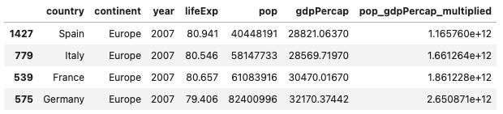
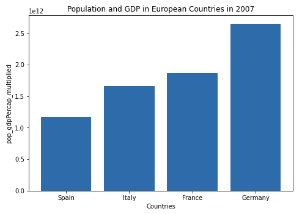

# Project 1

## Question 1
Package -- Packages can be provided or created. They serve to organize classes so that if there are multiple classes of the same name, the developer doesn't accidentally create an object from a class they didn't mean to. This is also called a namespace.
Library -- Libraries can contain several different resources, but in most cases libraries are used for their helper functions that the developer's code calls directly so the developer doesn't have to spend unnecessary time reimplementing already implemented solutions to basic problems.

There are several ways to install a package, my preferred way is through the package manager brew. I would do `brew install <name-of-package>`. In order to make use of the package, I do the following

```python
# imports specific method from random library
from random import randint
# import pandas and assign as alias for easy usage
import pandas as pd
import numpy as np
```

Aliasing can be important for two reasons:
1. Shorten a long library name to a two char name for ease of use
2. Consistency across academic and professional platforms

## Question 2
Coming from C.S., I like to think of a data frame as an two dimensional array of mutable information that be indexed and changed. More technically, a data frame is a mutable table of data represented in rows and columns. When working with a data frame, a useful library of functions for working with data frames is the pandas library. There are two ways to import data:

```python
# read in a file and print each line
with open('/path/to/file.csv', 'r') as f:
    for line in f:
        print(line)
# import a dataframe and assign it to a variable
data = pd.read_csv('/path/to/file.csv', sep='\t')
```

The `'\t'` argument denotes that there are parts of the data frame that are tab separated even though we are opening a comma separated file. This allows the data to successfully be read through when there are delimiters that might not be expected by the function. This is the case where data that is saved as a file in a different format might need a special sep= argument in order to create the data frame. I create a data frame using the read_csv() function.

```python
my_data = pd.read_csv('gapminder.tsv', sep = '\t')
my_data.head(5)
my_data.shape
```

The above imports information (data frame) from a tsv file and assigns it to a variable. Now that the data frame has been created, I verify that the data import was successful by getting the first 5 elements of the data frame. I can determine the amount of rows and columns in this `my_data` variable using the shape function. The data has 1704 rows and 6 columns. Another word for column is variable and another word for row is observation.

## Question 3
I created a new data frame below, and found that the variable does have regular intervals of 5 years. I used the unique() function to find a list of the years. In order to add new outcomes to the raw data, I would add years `[2012, 2017]`.

```python
data = pd.read_csv('gapminder.tsv', sep = '\t')
data.year.unique()
```

**Stretch question:** I figured out how many entries that would be by calculating the amount of unique countries there were in the data frame. This number ended up being 142. 142 times 2 (for each year that would be added) is 284, so the amount of additional entries would be 284.

## Question 4
I found the lowest life expectancy using the min() function. In order to figure out why the life expectancy was this low, I indexed the data frame to find out which country had the lowest life expectancy. My explanation is that life expectancy was this low because the Rwandan Civil War was taking place. This would lower the life expectancy given the amount of people that died during the way.

```python
data_lowest = data['lifeExp'].min()
data_lowest_idx = data['lifeExp'] == data_lowest
df_lowest = data[data_lowest_idx]
```

## Question 5
I multiplied the population and gdpPercap by first creating a new column in the data frame, and then assigned it the values of pop * gdpPercap (`data[['pop_gdpPercap_multiplied']] = data['pop'] * data['gdpPercap']`). Then in order to plot the population * gdpPercap with the four specified countries I indexed the data frame first by year, then extracted the specified countries. Once I had the correct data frame, I ordered it using the sort_values() method. I made the table with the matplotlib library. In the graph you can see that Spain has the lowest pop_gdpPercap_multiplied and Germany has the highest pop_gdpPercap_multiplied.

```python
# subset for year 2007
data_filtered_year_idx = data['year'] == 2007
data_filtered_year = data[data_filtered_year_idx]
# subset germany, france, italy, and spain
data_filtered_place_idx = ((data_filtered_year['country'] == 'Germany') |
                           (data_filtered_year['country'] == 'France') |
                           (data_filtered_year['country'] == 'Italy') |
                           (data_filtered_year['country'] == 'Spain'))
data_filtered_place = data_filtered_year[data_filtered_place_idx]
# order results
sorted_data = data_filtered_place.sort_values('pop_gdpPercap_multiplied', ascending=True)
```

**Stretch question:** Spain is the country that had the greatest increase from 2002 to 2007. I calculated this by subsetting my original data variable for the year 2002, getting the difference for each country from 2002 to 2007, and analyzing the results. Spain's increase was around 4,000, which was the highest out of all the countries.

Dataframe created after indexing and sorting:



Graph displaying results:



## Question 6
* '&' is the "and" operator and used to evaluate if two boolean statements are true. If both/all statements are true, only then does it return true. Otherwise it returns false.
* '==' is the equivalence operator and is used to evaluate if two objects are identical to each other in terms of value. If the two values are identical, then the operator returns true, otherwise false.
* '|' is the "or" operator and is used to evaluate if one of two boolean statements is true. As long as one or more of the statements is true it returns true. Otherwise it returns false.
* '^' is the "XOR" operator (exclusive or) and is used to evaluate if only one of the boolean statements is true. If more than one statement is true it returns false. It only returns true if one boolean statement is true.

```python
expression_1 = "Dogs"
expression_2 = "Cats"

# and operator
print((expression_1 == expression_2) & (expression_1 != expression_2))
# or operator
print((expression_1 == expression_2) | (expression_1 != expression_2))
# equivalence operator
print(expression_1 == expression_2)
# xor operator
print((expression_1 == expression_2) ^ (expression_1 != expression_2))
```

The output of the above script is False, True, False, True. This makes sense with the descriptions of each operator given above.

## Question 7
.loc vs .iloc
The main difference between these two functions is what they return. loc gets rows with specific labels, whereas iloc gets rows with integer locations (hence **i** loc).

```python
print(data.loc[:5])
print(data.iloc[:5])
```

**Stretch question:** I got all observations from a series of columns still using iloc and loc, but specifying which column, or variable, I want to extract the observations from. `data.country.iloc[:5]` gets the first 5 observations under the variable `country`. In order to get all the observations, I would do `data.country.iloc[:]`.

## Question 8
An API is access point to a server/database. It generally has documented protocols for get and send requests. A programmer might want data from a particular server, the API will tell the programmer how to access that data. Once the data is requested, the API will communicate its response to the machine the programmer is working on. The example for how to construct an API request, pull data, write to local file, etc. is below. I used the requests library in order to get the data from the url where the data is located. I give the path to the new file I created, open the file I got from the requests library, write the requested data to the new file, and use the pandas library to read the data into a new data frame.

```python
import requests
url = 'https://url/to/get/data/from'
r = requests.get(url)
filename = 'path/to/new/file'
with open(file_name, 'wb') as f:
    f.write(r.content)
df = pd.read_csv(file_name)
```

## Question 9
The apply function allows me to write succinct lambda functions (functions I might use only once or twice that aren't worth their own function) and apply those lambda functions inline to a data frame. When using the apply function, it's likely that I could have accomplished the same thing using a for loop or a separately declared function. But lambdas are a nice way to quickly write a function that I won't use multiple times.

## Question 10
There are several alternatives to loc and iloc, and they fit in two categories; provided methods and short two line algorithms. A method provided by the pandas library to filter the number of columns in a data frame is using **select_dtypes()**. This method takes both strings and numpy objects as parameters. Two other useful methods are **at[]** and **iat[]**. They are similar to loc and iloc, but operate much faster given that they can only access a single value at a time. A common way to filter a dataset without loc or iloc that isn't a method is simple indexing. This approach involves initially creating a boolean data frame that can then be compared to the data frame I want information from. The data frame from the boolean indexing is a filtered data frame with the information I wanted (this could be a specific year, name, etc.).
