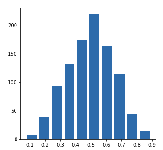
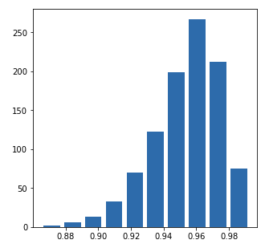

# Project 2

## Question 1
* Continuous Data: Numerical data that can take on a range of values and the difference/magnitude can be significant. An example would be temperature or someone's age.
* Ordinal Data: Numerical data where the order, not the value, is what's important. An example would be the order in which people win a competition (1st place, 2nd place, etc.).
* Nominal Data: Categorical data that can be represented by a number, but can also be represented by a categorical label. An example would be country, continent, and gender.

My model looks at political party (nominal data), age (continuous data), geographic location (ordinal data), and education level (ordinal data). More specifically, it looks at education level and age as predictors for what political party a person might align with. An example of a prediction with each of these features and target would be that a young person (age 18 - 23) who lives in an urban area with a college level education would vote democrat whereas someone more middle-aged (age 50 - 55) who lives in a rural area with a high school level education might tend to vote republican. Other interesting features to consider would be race, income, sexuality, or gender.

## Question 2

#### Approximating the 50th percentile

Mean: 0.4979341157825613
Median: 0.4939277566355549

alpha: 5.0
beta: 5.0

#### Right Skewed Plot

Mean: 0.16588161217678604
Median: 0.12074872930984337

alpha: 1.0
beta: 5.0

#### Left Skewed Plot

Mean: 0.9518371815427837
Median: 0.9549910605023373

alpha: 100.0
beta: 5.0

## Question 3

Non scaled histogram looking at the life expectancy in 1952 and 2007:

Logarithmic transformation looking at the life expectancy in 1952 and 2007:

Looking at both of these graphs, I believe the plot that best represents the change in life expectancy in various countries in the year 1952 and 2007 is the second plot, or the logarithmic transformation plot, for two reasons. The first has to do with the existence of bins in the second plot and the absence of bins in the first plot. In the first plot the bars don't totally line up, which makes it more difficult to adequately compare the two years we're examining. In the second plot, the bars are exactly lined up; making it easier to see that for a specific life expectancy, the years have two different values. The second reason is that in the first plot, the data is scaled in a way that makes it hard to understand. With the logarithmic transformation, comparing the data of 1952 and 2007 becomes clearer, and the heterogeneity of the data becomes more apparent.

## Question 4

Non scaled box plot looking at the population in all countries across all years in the dataset:

Logarithmic transformation looking at the population in all countries across all years in the dataset:

I believe it is very clear here that the second scaled graph is significantly easier to understand and interpret. In the first graph it's hard to see the details of the box plot, meaning that crucial details like median, mean, and outliers are very difficult to discern. In the second box plot it's much easier to see the median, mean, and all other features of the plot. This means that if someone wanted to look at my plot to understand the data plotted, the easily could without trying to read poorly scaled data.
